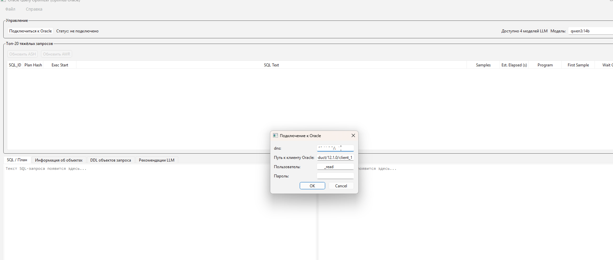
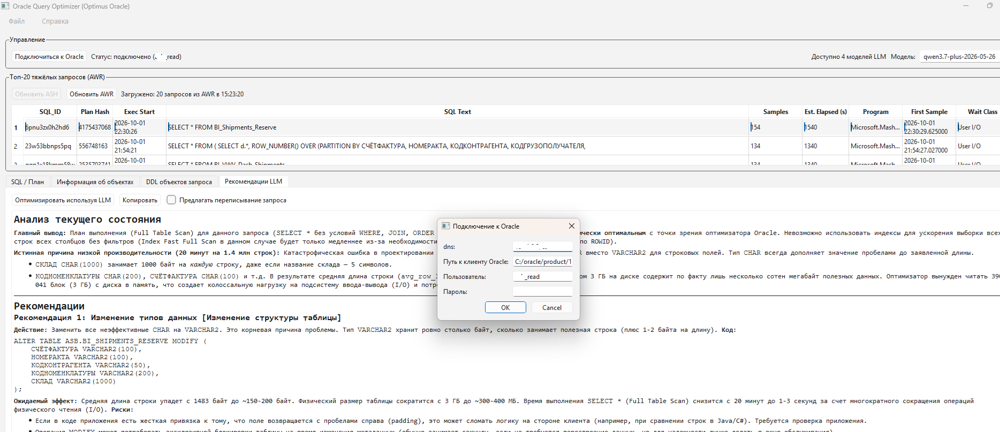
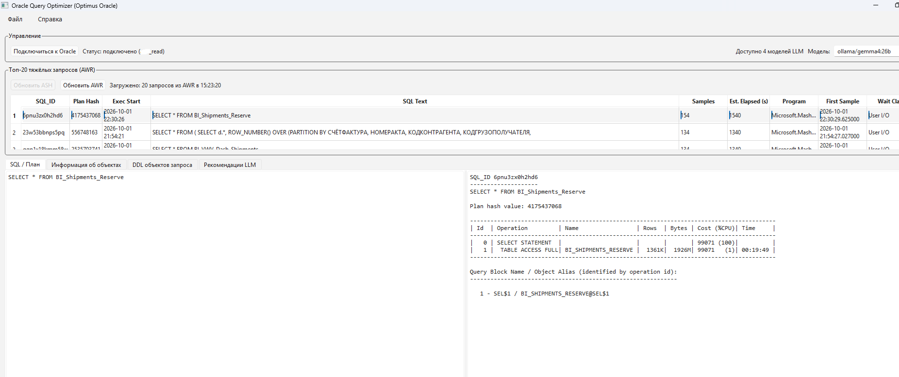
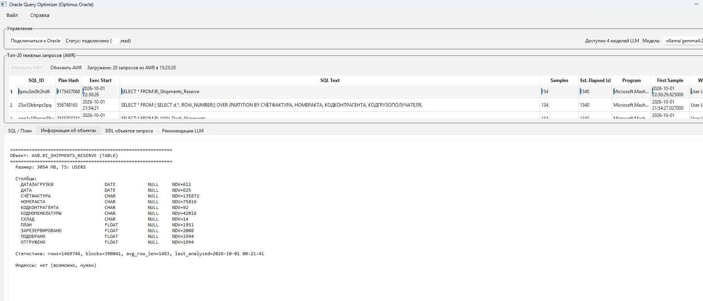
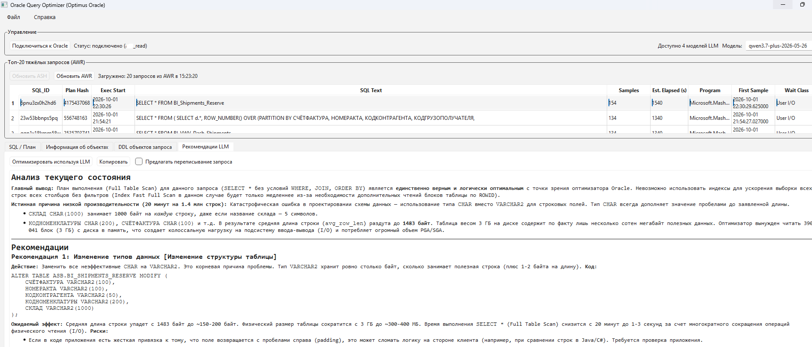
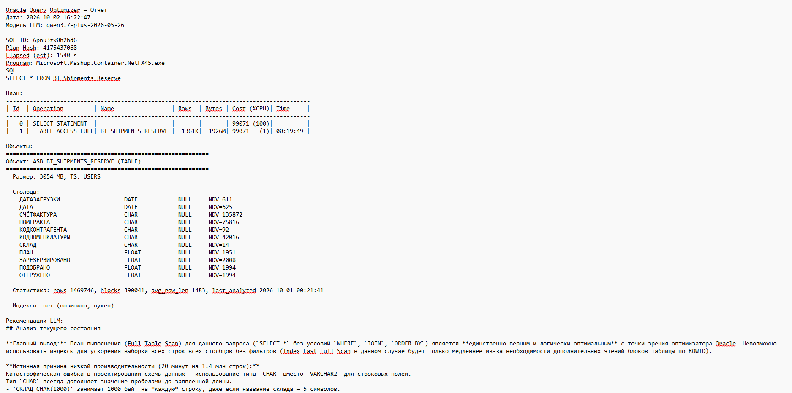

# Optimus Oracle

**AI-powered SQL optimizer for Oracle databases.**  
Finds heavy queries via ASH/AWR and generates optimization recommendations using LLMs — in seconds, not hours.

**Optimus Oracle** — приложение для поиска тяжёлых SQL-запросов в Oracle (через ASH/AWR) и получения рекомендаций по оптимизации от LLM-моделей.



[](LICENSE)
[](https://www.python.org/downloads/)

## The Problem

Ручной анализ Execution plan занимает время и требует экспертных знаний о работе ядра базы данных Oracle. Optimus Oracle автоматизирует этот цикл: находит тяжёлые запросы через ASH/AWR и получает структурированные рекомендации от LLM за секунды.

## Возможности

- 🔍 **Поиск тяжёлых запросов** — топ-20 из `V$ACTIVE_SESSION_HISTORY` за последние 12 часов (samples >= 10) или из `DBA_HIST_ACTIVE_SESS_HISTORY` за последние сутки
- 📋 **План выполнения** — загрузка из AWR через `dbms_xplan.display_awr` или `dbms_xplan.display_cursor`
- 📊 **Информация об объектах** — таблицы, столбцы, существующие индексы, статистика, размер сегментов из словарей БД
- 🤖 **Анализ LLM** — отправка SQL, плана, метаданных объектов и схемы в LLM для получения рекомендаций
- 🔌 **Поддержка нескольких провайдеров LLM** — OpenAI, DashScope, Ollama, LiteLLM
- 💾 **Экспорт отчёта** — сохранение всех данных и рекомендаций в текстовый файл

## Безопасность

Программа выполняет **только `SELECT`-запросы** к системным представлениям и словарям Oracle.  
Никакие DML или DDL команды не выполняются.

## Quick Start

### Зависимости
- Python 3.10+
- Oracle client libraries (или `oracledb` thin mode)
- Доступ к экземпляру Oracle с включёнными ASH/AWR
- API-ключ для LLM (OpenAI, DashScope) **или** локальный экземпляр Ollama

**1. Клонировать и установить зависимости**
```bash
git clone https://github.com/aleksanderFox/optimusOracle.git
cd optimusOracle
pip install -r requirements.txt
```

**2. (Опционально) Запустить Ollama для локальных моделей**
```bash
ollama serve
ollama pull llama3
```

**3. Запустить приложение**
```bash
python oracle_query_optimizer.py
```

### Установка Ollama (если требуется)

```bash
# macOS
brew install ollama

# Linux
curl -fsSL https://ollama.com/install.sh | sh

# Windows — скачайте с https://ollama.com
```

```bash
ollama serve
ollama pull llama3   # или qwen2.5, codellama, mistral
```

## Настройки

| Переменная                             | Описание                      | Пример                          |
| -------------------------------------- | ----------------------------- | ------------------------------- |
| ORACLE_QUEUE_OPTIMIZER_ORACLE_PATH     | Путь к драйверам Oracle       | C:/oracle/product/12.1.0/client |
| ORACLE_QUEUE_OPTIMIZER_ORACLE_DNS      | Адрес подключения к Oracle    | ip_address/database_sid         |
| ORACLE_QUEUE_OPTIMIZER_ORACLE_USER     | Имя пользователя по умолчанию | system                          |
| ORACLE_QUEUE_OPTIMIZER_LLM_TEMPERATURE | Температура LLM               | 0.3                             |

### Настройка LLM-моделей

ORACLE_QUEUE_OPTIMIZER_LLM_MODELS — JSON-массив списка используемых моделей:

```json
[
    {"provider": "llm_ollama.OllamaLLM", "server_name": "http://localhost:11434", "model_name": "qwen3:14b"},
    {"provider": "llm_lite.LiteLLM", "server_name": "http://localhost:11434", "model_name": "ollama/gemma4:26b"},
    {"provider": "llm_openai.OpenAILLM", "api_key": "API_KEY", "base_url": "https://{workspace_id}.ap-southeast-1.maas.aliyuncs.com/compatible-mode/v1", "model_name": "qwen3.7-plus", "is_remote": true},
    {"provider": "llm_alibaba.DashscopeLLM", "api_key": "API_KEY", "base_url": "https://{workspace_id}.ap-southeast-1.maas.aliyuncs.com/api/v1", "model_name": "qwen3.7-plus-2026-05-26", "workspace": "{workspace_id}", "is_remote": true}
]
```

**Провайдеры:**

- `llm_ollama.OllamaLLM` — подключение к Ollama
- `llm_openai.OpenAILLM` — подключение через OpenAI-совместимый API
- `llm_alibaba.DashscopeLLM` — подключение к Alibaba Qwen через DashScope
- `llm_lite.LiteLLM` — универсальный провайдер LiteLLM

> ⚠️ **Важно:** описывайте только те модели, к которым у вас есть доступ. Именно они будут анализировать SQL, план и метаданные объектов.

**Наблюдения по качеству моделей:**

- Локальные модели (`qwen3:14b`, `gemma4:26b`) плохо справляются с тяжёлыми запросами, содержащими множественные JOIN
- Облачная модель `qwen3.7-plus` хорошо анализирует сложные SQL-запросы и генерирует полезные советы

## Использование

1. Нажмите **«Подключиться к Oracle»** и введите параметры подключения

  
2. Нажмите **«Обновить ASH»** — загрузится топ-20 тяжёлых запросов из ASH  
3. Нажмите **«Обновить AWR»** — загрузится топ-20 тяжёлых запросов из AWR  
4. Выберите запрос в таблице — автоматически загрузятся план выполнения  
   и информация об объектах  
  
  
5. Нажмите **«Оптимизировать через LLM»** — модель проанализирует  
   запрос и предложит оптимизации  
  
6. Экспортируйте результат через меню **Файл → Экспорт отчёта**  


## Системные представления Oracle

Приложение обращается к следующим представлениям:

| Представление                     | Назначение               |
| --------------------------------- | ------------------------ |
| `V$ACTIVE_SESSION_HISTORY`        | Поиск тяжёлых запросов   |
| `V$SQLAREA`                       | Текст SQL-запросов       |
| `DBMS_XPLAN.DISPLAY_AWR`          | План выполнения из AWR   |
| `DBA_HIST_SQL_PLAN`               | Объекты из плана запроса |
| `DBA_OBJECTS`                     | Информация об объектах   |
| `DBA_SEGMENTS`                    | Размер сегментов         |
| `DBA_INDEXES` / `DBA_IND_COLUMNS` | Существующие индексы     |
| `DBA_TAB_COLUMNS`                 | Столбцы таблиц           |
| `DBA_TABLES`                      | Статистика по таблицам   |

## Требования к правам

Пользователь Oracle должен иметь права на чтение системных представлений:

```sql
-- Минимальные гранты (роли)
GRANT SELECT_CATALOG_ROLE TO <user>;

-- Или индивидуальные гранты
GRANT SELECT ON V$ACTIVE_SESSION_HISTORY TO <user>;
GRANT SELECT ON V$SQLAREA TO <user>;
GRANT SELECT ON DBA_HIST_SQLTEXT TO <user>;
GRANT SELECT ON DBA_HIST_SQL_PLAN TO <user>;
GRANT SELECT ON DBA_OBJECTS TO <user>;
GRANT SELECT ON DBA_SEGMENTS TO <user>;
GRANT SELECT ON DBA_INDEXES TO <user>;
GRANT SELECT ON DBA_IND_COLUMNS TO <user>;
GRANT SELECT ON DBA_TAB_COLUMNS TO <user>;
GRANT SELECT ON DBA_TABLES TO <user>;
GRANT EXECUTE ON DBMS_XPLAN TO <user>;
```

## Roadmap

- [x] Сбор тяжёлых запросов из ASH/AWR  
- [x] Поддержка Ollama, LiteLLM, DashScope, OpenAI  
- [ ] Поддержка Google GenAI  
- [ ] Поддержка Anthropic Claude  
- [ ] Add multi language support  
См. [открытые issues](https://github.com/aleksanderFox/optimusOracle/issues) для полного списка.

## Contributing

Я рад вкладу в проект!

- 🐛 Нашли баг? [Откройте issue](https://github.com/aleksanderFox/optimusOracle/issues/new)
- 💡 Есть идея? Начните [discussion](https://github.com/aleksanderFox/optimusOracle/discussions)

## License

MIT © Aleksander Fox

См. файл [LICENSE](LICENSE) для подробностей.